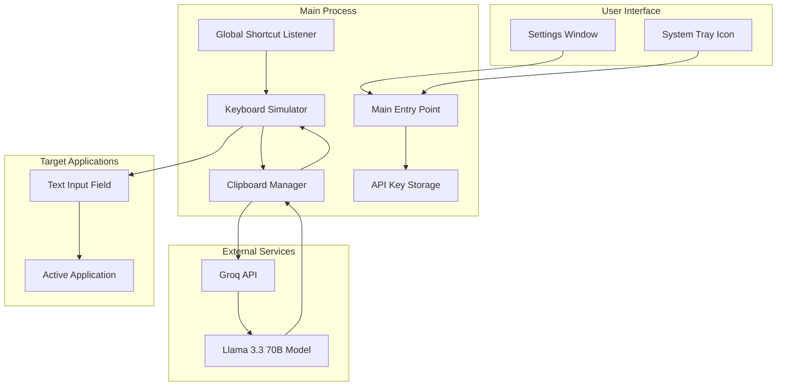
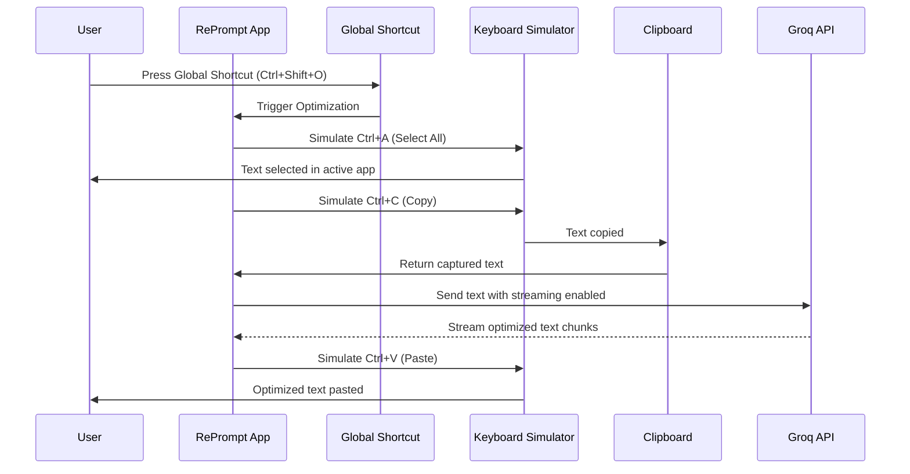
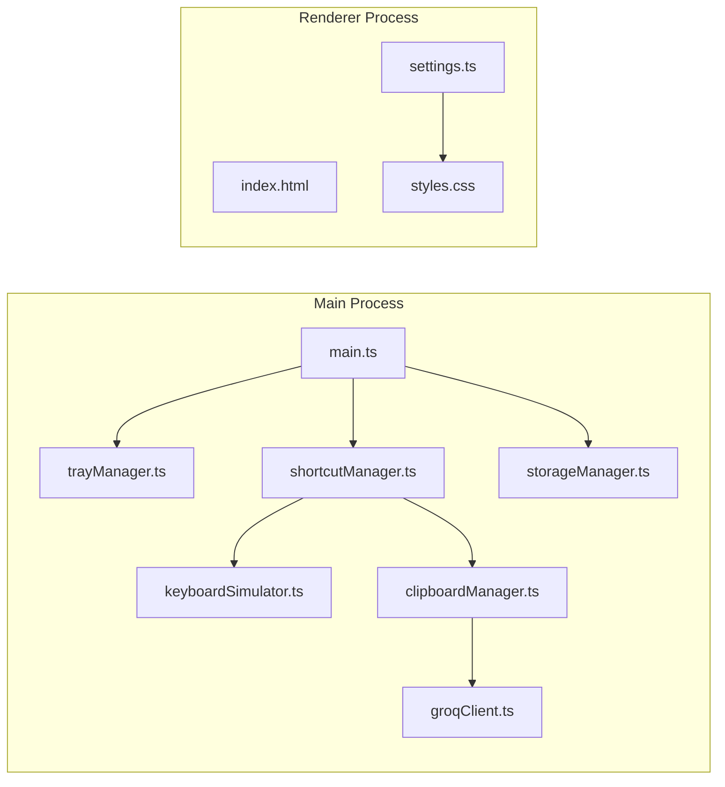
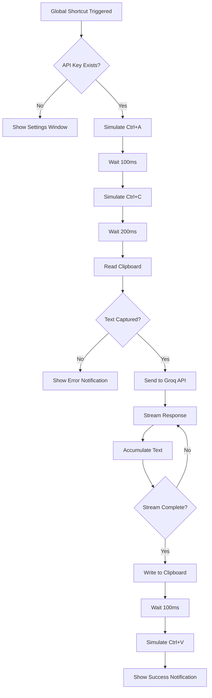

# RePrompt - Global AI Text Optimizer

## Project Overview

A Windows Electron desktop application that functions as a global AI text optimizer. The app runs in the background/system tray and uses a global shortcut to capture, optimize, and replace text in any active application using the Groq API with Llama 3.3 70B model. The application features a dark mode interface that strictly adheres to the Notion design system with exact color codes.

## Design System: Notion Dark Mode

### Color Palette (Exact Notion Dark Mode Codes)

```css
/* Background Colors */
--bg-primary: #191919;
--bg-secondary: #202020;
--bg-tertiary: #2F2F2F;
--bg-hover: #2C2C2C;
--bg-active: #3A3A3A;
--bg-sidebar: #191919;
--bg-card: #202020;
--bg-input: #2F2F2F;

/* Text Colors */
--text-primary: #FFFFFF;
--text-secondary: #D4D4D4;
--text-tertiary: #9B9A97;
--text-placeholder: #6B6B6B;
--text-muted: #787774;

/* Accent Colors */
--accent-blue: #2383E2;
--accent-blue-hover: #1A6BC0;
--accent-blue-light: #1E3A5F;
--accent-blue-bg: rgba(35, 131, 226, 0.1);

/* Border Colors */
--border-default: #3F3F3F;
--border-focus: #2383E2;
--border-hover: #4A4A4A;
--border-subtle: #2F2F2F;

/* Status Colors */
--success: #0F7B6C;
--success-bg: rgba(15, 123, 108, 0.1);
--warning: #D9730D;
--warning-bg: rgba(217, 115, 13, 0.1);
--error: #E03E3E;
--error-bg: rgba(224, 62, 62, 0.1);

/* Additional Dark Mode Colors */
--overlay: rgba(0, 0, 0, 0.5);
--divider: #3F3F3F;
--code-bg: #2F2F2F;
--selection: rgba(35, 131, 226, 0.3);
```

### Typography

```css
/* Font Family */
--font-family: -apple-system, BlinkMacSystemFont, "Segoe UI", Helvetica, "Apple Color Emoji", Arial, sans-serif;

/* Font Sizes */
--font-size-xs: 11px;
--font-size-sm: 12px;
--font-size-md: 14px;
--font-size-lg: 16px;
--font-size-xl: 18px;

/* Font Weights */
--font-weight-regular: 400;
--font-weight-medium: 500;
--font-weight-semibold: 600;
```

### Design Principles

- **Dark mode only** - All UI elements use dark theme colors
- **No shadows or glow effects** - Flat design only
- **Minimal borders** - 1px solid with subtle colors (#3F3F3F default)
- **Clean spacing** - Consistent padding/margins (8px, 12px, 16px, 24px)
- **Simple interactions** - Hover states only, no complex animations
- **High contrast** - Ensure text readability on dark backgrounds
- **Subtle backgrounds** - Use layered backgrounds for depth without shadows

## Architecture

### System Architecture Diagram



### Data Flow Diagram



### Component Architecture



## Technical Specifications

### Core Dependencies

```json
{
  "dependencies": {
    "electron": "^28.0.0",
    "groq-sdk": "^0.3.0",
    "robotjs": "^0.6.0",
    "electron-store": "^8.1.0"
  },
  "devDependencies": {
    "typescript": "^5.3.0",
    "@types/node": "^20.10.0",
    "electron-builder": "^24.9.0"
  }
}
```

### Project Structure

```
RePrompt/
├── src/
│   ├── main/
│   │   ├── main.ts              # Main entry point
│   │   ├── trayManager.ts       # System tray management
│   │   ├── shortcutManager.ts   # Global shortcut handling
│   │   ├── keyboardSimulator.ts # Keyboard simulation (robotjs)
│   │   ├── clipboardManager.ts  # Clipboard operations
│   │   ├── groqClient.ts        # Groq API integration
│   │   └── storageManager.ts    # Secure API key storage
│   ├── renderer/
│   │   ├── index.html           # Settings window HTML
│   │   ├── settings.ts          # Settings UI logic
│   │   └── styles.css           # Notion design system CSS
│   └── preload/
│       └── preload.ts           # Preload script for IPC
├── resources/
│   └── icons/                   # Application icons
├── package.json
├── tsconfig.json
├── electron-builder.yml
└── README.md
```

## Key Implementation Details

### 1. Global Shortcut Listener

**File:** `src/main/shortcutManager.ts`

- Uses `electron.globalShortcut`
- Default shortcut: `Ctrl+Shift+O` (configurable)
- Triggers text optimization workflow
- Prevents multiple simultaneous optimizations

### 2. Keyboard Simulation

**File:** `src/main/keyboardSimulator.ts`

- Uses `robotjs` library
- Simulates key combinations:
  - `Ctrl+A` (Select All)
  - `Ctrl+C` (Copy)
  - `Ctrl+V` (Paste)
- Adds delays between keystrokes for reliability
- Handles different keyboard layouts

### 3. Groq API Integration

**File:** `src/main/groqClient.ts`

```typescript
import Groq from "groq-sdk";

const groq = new Groq({ apiKey: storedApiKey });

const stream = await groq.chat.completions.create({
  messages: [{ role: "user", content: capturedText }],
  model: "llama-3.3-70b-versatile",
  temperature: 1,
  max_tokens: 1024,
  top_p: 1,
  stream: true,
});

for await (const chunk of stream) {
  const content = chunk.choices[0]?.delta?.content || "";
  // Accumulate streaming content
}
```

### 4. Secure API Key Storage

**File:** `src/main/storageManager.ts`

- Uses `electron-store` with encryption
- Stores API key in user data directory
- Provides methods to get/set/delete API key
- Validates API key format before saving

### 5. System Tray Integration

**File:** `src/main/trayManager.ts`

- Creates system tray icon
- Shows context menu with options:
  - Open Settings
  - Toggle Global Shortcut
  - Check API Key Status
  - Quit Application
- Displays status indicator (active/inactive)

### 6. Settings UI

**File:** `src/renderer/settings.ts`

- Minimalist Notion dark mode interface
- API key input field (password type)
- Save/Cancel buttons
- Status messages (success/error)
- Global shortcut configuration
- About section

## Workflow Implementation

### Text Optimization Workflow



### Error Handling

- API key missing/invalid
- Network errors
- Groq API errors
- Clipboard access denied
- Keyboard simulation failures
- Empty text captured

##